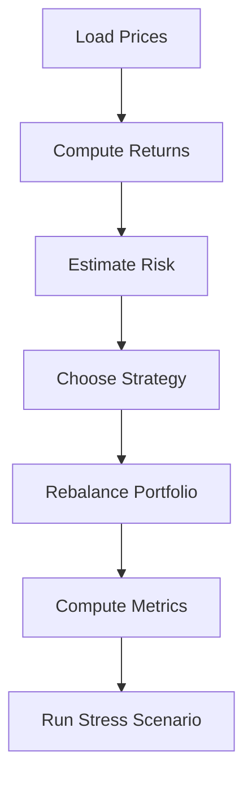
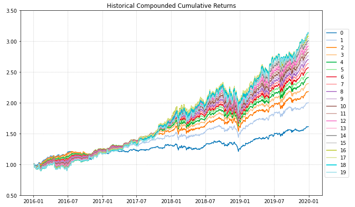
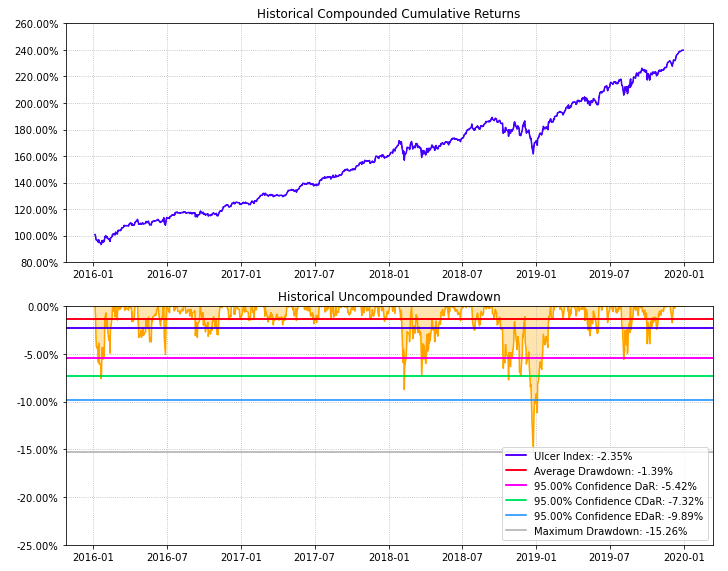
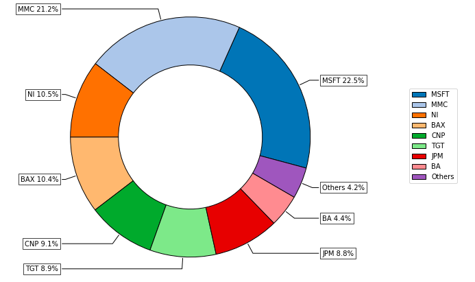
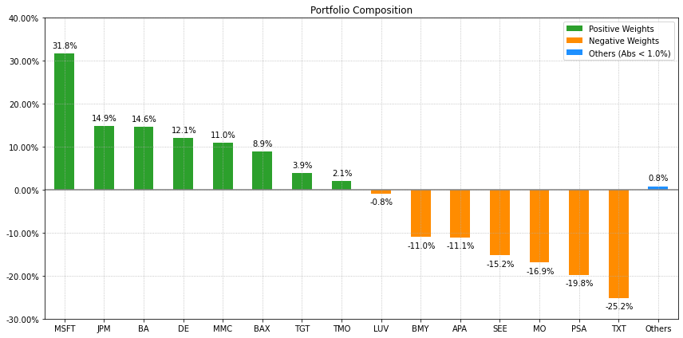

<div align="center">

# Portfolio Engine

**A compact framework for portfolio allocation, risk modeling, and backtesting.**

A practical toolkit for **students**, **researchers**, and **practitioners** exploring Strategic Asset Allocation and portfolio behavior over time.

</div>

---

## Table of Contents

- [Project Snapshot](#project-snapshot)
- [System Overview Diagram](#system-overview-diagram)
- [Workflow Illustration](#workflow-illustration)
- [Core Features](#core-features)
- [Project Structure](#project-structure)
- [Installation](#installation)
- [Quick Start](#quick-start)
- [Example Output](#example-output)
- [Using in Notebooks & Research](#using-in-notebooks--research)
- [Design Principles](#design-principles)
- [Extending the Engine](#extending-the-engine)
- [Use Cases](#use-cases)

---

## Project Snapshot

`portfolio_engine` is a small, focused Python library for:

- **Building multi-asset portfolios** using simple but realistic allocation rules.
- **Quantifying risk** through covariance, volatility, and drawdowns.
- **Running backtests** with configurable rebalancing schedules.
- **Comparing strategies** on return, risk, and capital efficiency.

The codebase is intentionally compact so you can read, modify, and extend it quickly, while still mirroring patterns used in real investment and risk teams.

---

## System Overview Diagram


*This diagram shows how raw price files move through `data_loader`, become return series, feed into `risk_models` and `optimizer`, and finally flow through `backtest` into `analytics` and `scenario` modules.*

---

## Workflow Illustration



*This pipeline highlights the research workflow: starting from raw prices, you build a risk view, choose a strategy, run a backtest, and then evaluate outcomes and shocks.*

---

## Core Features

### Allocation & Strategy

- **Equal-weight benchmark**  
  Simple diversification baseline where each asset receives the same capital share.

- **Mean–variance allocation**  
  Allocate capital to balance expected return vs. portfolio variance under basic weight constraints.

- **Risk-parity style allocation**  
  Construct portfolios where assets contribute more evenly to overall variance.

### Risk & Analytics

- **Risk modeling**
  - Empirical covariance matrices.
  - Per-asset and portfolio volatility.
  - Rolling volatility as a simple way to view changing risk.

- **Performance metrics**
  - Cumulative and annualized return.
  - Annualized volatility.
  - Sharpe-style ratios (excess return over risk-free).
  - Maximum drawdown and related drawdown statistics.

### Backtesting & Scenarios

- **Backtesting engine**
  - Rebalancing at configurable intervals (e.g., daily, monthly).
  - Strategy function is re-evaluated at each rebalance date.
  - Tracks portfolio value and weights over time.

- **Scenario tools**
  - Define shock vectors (e.g., sudden drop in an equity index).
  - Apply shocks to current weights to estimate instantaneous loss.
  - Compare strategy behavior under the same stress event.

---

## Project Structure

The code is broken into small, single-purpose modules:

| Module             | Responsibility |
|--------------------|----------------|
| `config.py`        | Central configuration for the allocation and backtest (lookback, risk-free rate, bounds, rebalance frequency, etc.). |
| `data_loader.py`   | Reading price data (e.g., CSV files) and converting them into return series. |
| `risk_models.py`   | Building covariance matrices, volatilities, and other basic risk statistics. |
| `optimizer.py`     | Implementing mean–variance and risk-parity style optimizers under simple constraints. |
| `analytics.py`     | Computing performance metrics and risk diagnostics from backtest results. |
| `backtest.py`      | Running the rebalancing loop through time and recording portfolio paths. |
| `main.py`          | Example script that wires all the pieces into an end-to-end run. |

A typical information flow looks like:

```text
Price CSVs
  → data_loader (returns)
  → risk_models (covariance, vol)
  → optimizer / strategy (weights)
  → backtest (portfolio path)
  → analytics & scenarios (performance, risk, stress tests)
```

---

## Installation

Clone the repository and install dependencies into your environment (e.g., `venv`, `conda`):

```bash
git clone <YOUR_REPO_URL> portfolio_engine
cd portfolio_engine
pip install -r requirements.txt
```

For interactive work, you may also want:

```bash
pip install jupyter matplotlib
```

> **Note**  
> This project deliberately avoids heavy convex optimization stacks. It aims to be easy to run, understand, and extend, rather than covering every possible portfolio model.

---

## Quick Start

From the project root:

```bash
cd portfolio_engine
python main.py
```

This sample run will typically:

1. Load example price (or synthetic) data.
2. Compute return series and an empirical covariance matrix.
3. Generate three portfolios:
   - Equal-weight baseline.
   - Mean–variance allocation.
   - Risk-parity style allocation.
4. Run a backtest over the available history with a chosen rebalance schedule.
5. Print a concise report of returns, risk, and drawdowns for each strategy.

Use this script as both:

- A **reference implementation** of the pipeline.
- A **starting point** for your own allocation experiments.

---

## Example Output

### Equity Curve

Shows cumulative portfolio value for each strategy, starting from a normalized base of 1.0.



*Used to compare long-term growth and relative performance across allocation strategies.*

---

### Drawdown Profile

Tracks peak-to-trough losses through time for each strategy.



*Highlights downside risk and recovery characteristics.*
---

### Portfolio Weights Evolution

Shows how capital allocation shifts across assets at each rebalance date.



*Helps identify concentration risk, turnover, and allocation stability.*

---

### Strategy Comparison

Side-by-side comparison of key performance metrics across strategies.



*Summarizes trade-offs between return, volatility, Sharpe ratio, and drawdown.*
---

## Using in Notebooks & Research

The modules are designed to be imported directly into notebooks or other research scripts.

Example sketch of an interactive session:

```python
import pandas as pd

from portfolio_engine import (
    data_loader,
    risk_models,
    optimizer,
    backtest,
    analytics,
    config,
)

# 1. Load price data and compute returns
prices = data_loader.load_prices("data/prices.csv")
returns = data_loader.compute_returns(prices)

# 2. Build a simple risk model
cov, vol = risk_models.sample_covariance(returns)

# 3. Set up configuration
cfg = config.AllocationConfig(
    lookback_window=252,
    rebalance_frequency="M",
    min_weight=0.0,
    max_weight=0.3,
    risk_free_rate=0.02,
)

# 4. Choose allocation rule (e.g., mean–variance)
strategy_fn = optimizer.mean_variance_strategy(cfg)

# 5. Run backtest
results = backtest.run_backtest(returns, strategy_fn, cfg)

# 6. Summarize performance
report = analytics.performance_report(results.portfolio_values)
print(report)
```

You can easily swap in a different strategy function (equal-weight, risk-parity, or your own custom rule) and compare outcomes.

---

## Design Principles

- **Clarity over complexity**  
  Functions have explicit inputs and outputs. The configuration is visible rather than hidden in global state.

- **Realistic enough to matter**  
  While lightweight, the pipeline reflects how real investment teams think about risk, allocation, and rebalancing.

- **Experiment-friendly**  
  Components are small and modular, so it is straightforward to:
  - Attach new risk estimators,
  - Add allocation rules,
  - Or extend analytics without rewriting the backtest engine.

- **Readable for teaching**  
  The code is written to be understandable by readers with basic Python and finance knowledge, making it suitable for courses, workshops, and interviews.

---

## Extending the Engine

Some natural extensions you might consider:

- **New allocation methods**
  - Minimum-volatility portfolios.
  - Sharpe-maximizing portfolios with sector constraints.
  - Target-volatility or target-risk strategies.

- **Richer risk models**
  - Exponentially weighted covariance matrices.
  - Simple factor-based risk models.
  - Regime-based volatility adjustments.

- **Additional constraints**
  - Turnover limits between rebalances.
  - Leverage caps and short-selling rules.
  - Group / sector exposure limits.

- **Reporting & visualization**
  - Notebook dashboards summarizing risk/return.
  - Exportable HTML or PDF reports for non-technical stakeholders.

---


